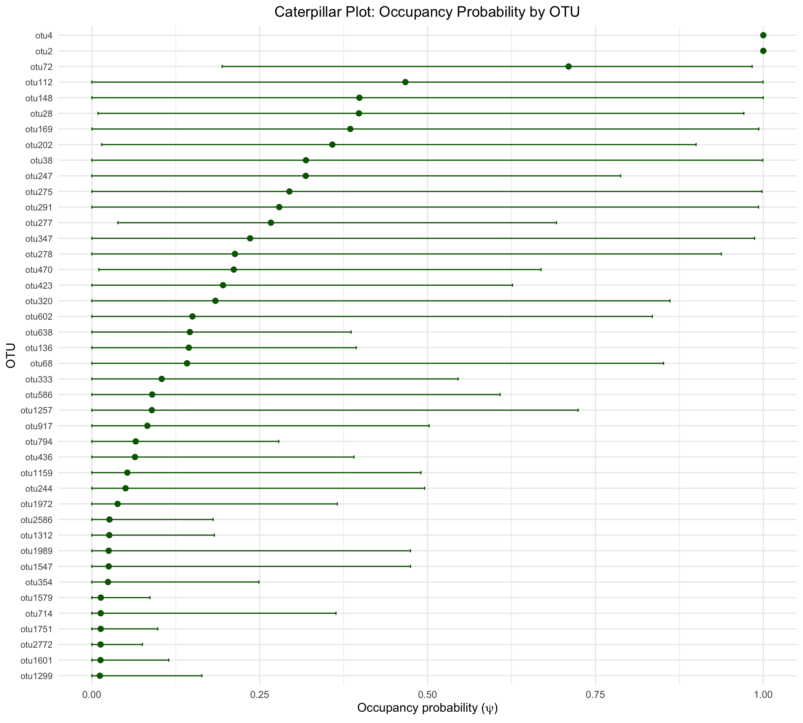
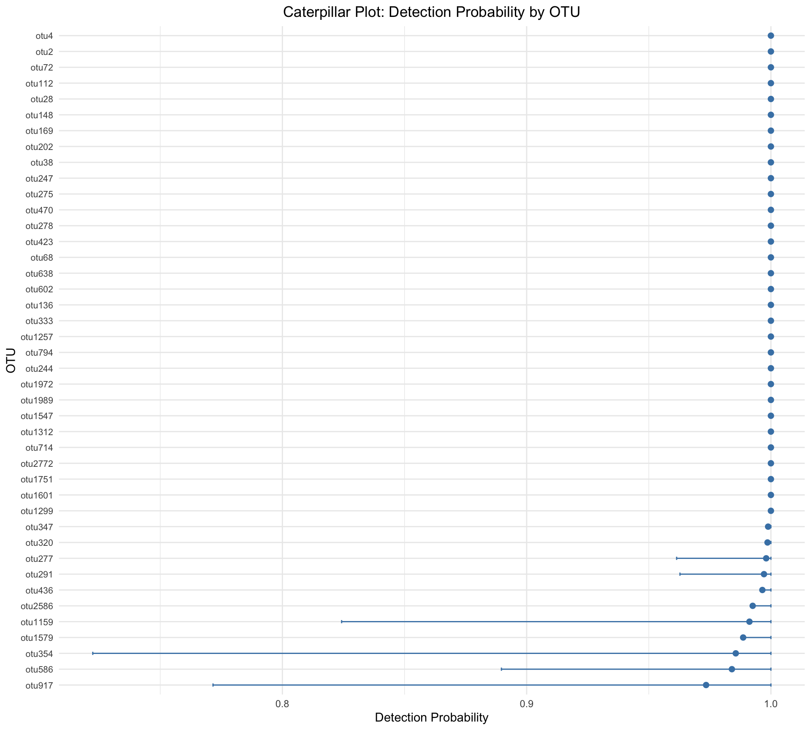
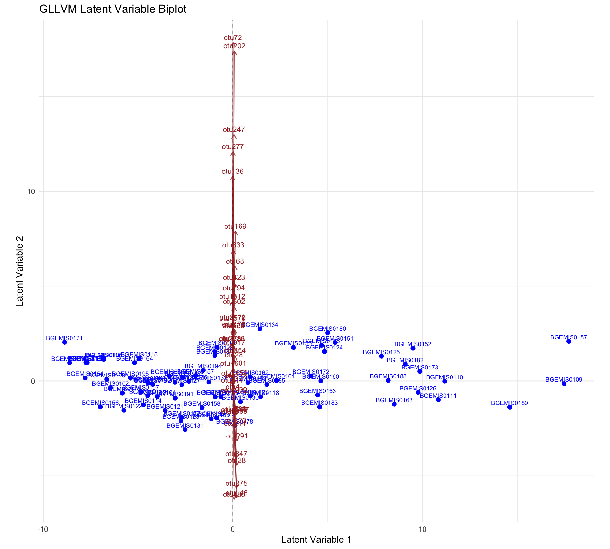

``` r
library(phyloseq)
library(Matrix)
library(eDNAModel)
library(dplyr)
library(tidyr)
library(ggplot2)
library(pheatmap)
library(tibble)
library(gllvm)
library(glmmTMB)
library(reshape2)
library(grid)
```

# 1. Introduction

This vignette demonstrates the updated occupancy--detection model workflow
using the `eDNAModel` package and `phyloseq` data objects. The workflow
includes fitting occupancy, capture, and abundance models across repeated
iterations, visualizing occupancy and detection probabilities, and using
GLLVM latent variables to describe multivariate structure among taxa and
samples.

# 2. Load and Subset Data

The example data are supplied with the `eDNAModel` package. This makes the
vignette reproducible without relying on files stored on the user's local
computer.


``` r
data("physeq_new", package = "eDNAModel")

physeq_one <- physeq_new$`Marine Invasive species Trondheim`
```

# 3. Fit the Occupancy--Detection Model


```
#> No abundance offset detected.
#> OTUs before filtering: 43
#> OTUs after filtering: 42
#> Iteration 1
#> Warning in se.gllvm(out): 9 parameter(s) have negative variance estimates (b x5, lambda x3, sigmaLV
#> x1). The model likely has not converged - consider re-fitting.
#> Warning in finalizeTMB(TMBStruc, obj, fit, h, data.tmb.old): Model convergence problem; false
#> convergence (8). See vignette('troubleshooting'), help('diagnose')
#> Iteration 1 finished in 1.27 seconds
#> Iteration 2
#> Warning in se.gllvm(out): 21 parameter(s) have negative variance estimates (b x5, lambda x15,
#> sigmaLV x1). The model likely has not converged - consider re-fitting.
#> Iteration 2 finished in 1.25 seconds
#> Iteration 3
#> Warning in se.gllvm(out): 9 parameter(s) have negative variance estimates (b x9). The model likely
#> has not converged - consider re-fitting.
#> Warning in se.gllvm(out): Model convergence problem; false convergence (8). See
#> vignette('troubleshooting'), help('diagnose')
#> Iteration 3 finished in 1.27 seconds
#> Iteration 4
#> Warning in se.gllvm(out): 11 parameter(s) have negative variance estimates (b x11). The model
#> likely has not converged - consider re-fitting.
#> Warning in se.gllvm(out): Model convergence problem; false convergence (8). See
#> vignette('troubleshooting'), help('diagnose')
#> Iteration 4 finished in 1.26 seconds
#> Iteration 5
#> Warning in se.gllvm(out): 6 parameter(s) have negative variance estimates (b x6). The model likely
#> has not converged - consider re-fitting.
#> Iteration 5 finished in 1.24 seconds
#> Iteration 6
#> Warning in se.gllvm(out): 8 parameter(s) have negative variance estimates (b x4, lambda x3, sigmaLV
#> x1). The model likely has not converged - consider re-fitting.
#> Warning in se.gllvm(out): Model convergence problem; false convergence (8). See
#> vignette('troubleshooting'), help('diagnose')
#> Iteration 6 finished in 1.28 seconds
#> Iteration 7
#> Warning in se.gllvm(out): 21 parameter(s) have negative variance estimates (b x12, lambda x8,
#> sigmaLV x1). The model likely has not converged - consider re-fitting.
#> Iteration 7 finished in 1.31 seconds
#> Iteration 8
#> Warning in se.gllvm(out): 7 parameter(s) have negative variance estimates (b x7). The model likely
#> has not converged - consider re-fitting.
#> Warning in se.gllvm(out): Model convergence problem; false convergence (8). See
#> vignette('troubleshooting'), help('diagnose')
#> Iteration 8 finished in 1.27 seconds
#> Iteration 9
#> Warning in se.gllvm(out): 3 parameter(s) have negative variance estimates (b x3). The model likely
#> has not converged - consider re-fitting.
#> Warning in se.gllvm(out): Model convergence problem; false convergence (8). See
#> vignette('troubleshooting'), help('diagnose')
#> Iteration 9 finished in 1.26 seconds
#> Iteration 10
#> Warning in se.gllvm(out): 17 parameter(s) have negative variance estimates (b x13, lambda x3,
#> sigmaLV x1). The model likely has not converged - consider re-fitting.
#> Warning in se.gllvm(out): Model convergence problem; false convergence (8). See
#> vignette('troubleshooting'), help('diagnose')
#> Iteration 10 finished in 1.26 seconds
#> Iteration 11
#> Warning in se.gllvm(out): 18 parameter(s) have negative variance estimates (b x7, lambda x10,
#> sigmaLV x1). The model likely has not converged - consider re-fitting.
#> Warning in se.gllvm(out): Model convergence problem; false convergence (8). See
#> vignette('troubleshooting'), help('diagnose')
#> Iteration 11 finished in 1.26 seconds
#> Iteration 12
#> Warning in se.gllvm(out): 10 parameter(s) have negative variance estimates (b x10). The model
#> likely has not converged - consider re-fitting.
#> Warning in se.gllvm(out): Model convergence problem; false convergence (8). See
#> vignette('troubleshooting'), help('diagnose')
#> Iteration 12 finished in 1.25 seconds
#> Iteration 13
#> Warning in se.gllvm(out): 44 parameter(s) have negative variance estimates (b x18, lambda x25,
#> sigmaLV x1). The model likely has not converged - consider re-fitting.
#> Warning in se.gllvm(out): Model convergence problem; false convergence (8). See
#> vignette('troubleshooting'), help('diagnose')
#> Iteration 13 finished in 2.14 seconds
#> Iteration 14
#> Iteration 14 finished in 1.67 seconds
#> Iteration 15
#> Warning in se.gllvm(out): 5 parameter(s) have negative variance estimates (lambda x4, sigmaLV x1).
#> The model likely has not converged - consider re-fitting.
#> Iteration 15 finished in 1.24 seconds
#> Iteration 16
#> Warning in se.gllvm(out): 35 parameter(s) have negative variance estimates (b x1, lambda x33,
#> sigmaLV x1). The model likely has not converged - consider re-fitting.
#> Iteration 16 finished in 1.88 seconds
#> Iteration 17
#> Warning in finalizeTMB(TMBStruc, obj, fit, h, data.tmb.old): Model convergence problem; false
#> convergence (8). See vignette('troubleshooting'), help('diagnose')
#> Iteration 17 finished in 1.66 seconds
#> Iteration 18
#> Warning in se.gllvm(out): 9 parameter(s) have negative variance estimates (b x9). The model likely
#> has not converged - consider re-fitting.
#> Warning in se.gllvm(out): Model convergence problem; false convergence (8). See
#> vignette('troubleshooting'), help('diagnose')
#> Iteration 18 finished in 2.29 seconds
#> Iteration 19
#> Warning in se.gllvm(out): 4 parameter(s) have negative variance estimates (lambda x3, sigmaLV x1).
#> The model likely has not converged - consider re-fitting.
#> Warning in se.gllvm(out): Model convergence problem; false convergence (8). See
#> vignette('troubleshooting'), help('diagnose')
#> Iteration 19 finished in 1.62 seconds
#> Iteration 20
#> Iteration 20 finished in 1.72 seconds
#> Iteration 21
#> Iteration 21 finished in 1.62 seconds
#> Iteration 22
#> Warning in se.gllvm(out): 19 parameter(s) have negative variance estimates (b x9, lambda x9,
#> sigmaLV x1). The model likely has not converged - consider re-fitting.
#> Iteration 22 finished in 1.31 seconds
#> Iteration 23
#> Iteration 23 finished in 1.21 seconds
#> Iteration 24
#> Warning in se.gllvm(out): 6 parameter(s) have negative variance estimates (b x6). The model likely
#> has not converged - consider re-fitting.
#> Iteration 24 finished in 1.27 seconds
#> Iteration 25
#> Warning in se.gllvm(out): 6 parameter(s) have negative variance estimates (b x2, lambda x3, sigmaLV
#> x1). The model likely has not converged - consider re-fitting.
#> Iteration 25 finished in 1.3 seconds
#> Iteration 26
#> Warning in se.gllvm(out): 1 parameter(s) have negative variance estimates (b x1). The model likely
#> has not converged - consider re-fitting.
#> Iteration 26 finished in 1.33 seconds
#> Iteration 27
#> Warning in se.gllvm(out): 26 parameter(s) have negative variance estimates (b x10, lambda x15,
#> sigmaLV x1). The model likely has not converged - consider re-fitting.
#> Iteration 27 finished in 1.28 seconds
#> Iteration 28
#> Warning in se.gllvm(out): 13 parameter(s) have negative variance estimates (b x6, lambda x6,
#> sigmaLV x1). The model likely has not converged - consider re-fitting.
#> Iteration 28 finished in 1.29 seconds
#> Iteration 29
#> Warning in se.gllvm(out): 6 parameter(s) have negative variance estimates (b x6). The model likely
#> has not converged - consider re-fitting.
#> Iteration 29 finished in 1.8 seconds
#> Iteration 30
#> Iteration 30 finished in 1.71 seconds
#> Iteration 31
#> Warning in se.gllvm(out): 6 parameter(s) have negative variance estimates (b x6). The model likely
#> has not converged - consider re-fitting.
#> Warning in se.gllvm(out): Model convergence problem; false convergence (8). See
#> vignette('troubleshooting'), help('diagnose')
#> Iteration 31 finished in 1.35 seconds
#> Iteration 32
#> Warning in se.gllvm(out): 2 parameter(s) have negative variance estimates (b x2). The model likely
#> has not converged - consider re-fitting.
#> Warning in se.gllvm(out): Model convergence problem; false convergence (8). See
#> vignette('troubleshooting'), help('diagnose')
#> Iteration 32 finished in 2.03 seconds
#> Iteration 33
#> Warning in se.gllvm(out): 19 parameter(s) have negative variance estimates (b x8, lambda x10,
#> sigmaLV x1). The model likely has not converged - consider re-fitting.
#> Warning in se.gllvm(out): Model convergence problem; false convergence (8). See
#> vignette('troubleshooting'), help('diagnose')
#> Iteration 33 finished in 1.28 seconds
#> Iteration 34
#> Warning in se.gllvm(out): 9 parameter(s) have negative variance estimates (b x5, lambda x3, sigmaLV
#> x1). The model likely has not converged - consider re-fitting.
#> Iteration 34 finished in 1.27 seconds
#> Iteration 35
#> Iteration 35 finished in 1.66 seconds
#> Iteration 36
#> Warning in se.gllvm(out): 6 parameter(s) have negative variance estimates (b x2, lambda x3, sigmaLV
#> x1). The model likely has not converged - consider re-fitting.
#> Iteration 36 finished in 1.31 seconds
#> Iteration 37
#> Iteration 37 finished in 1.61 seconds
#> Iteration 38
#> Warning in se.gllvm(out): 8 parameter(s) have negative variance estimates (b x8). The model likely
#> has not converged - consider re-fitting.
#> Iteration 38 finished in 1.57 seconds
#> Iteration 39
#> Warning in se.gllvm(out): 10 parameter(s) have negative variance estimates (b x10). The model
#> likely has not converged - consider re-fitting.
#> Warning in se.gllvm(out): Model convergence problem; false convergence (8). See
#> vignette('troubleshooting'), help('diagnose')
#> Iteration 39 finished in 1.28 seconds
#> Iteration 40
#> Warning in se.gllvm(out): 27 parameter(s) have negative variance estimates (b x27). The model
#> likely has not converged - consider re-fitting.
#> Iteration 40 finished in 2.12 seconds
#> Iteration 41
#> Warning in se.gllvm(out): 17 parameter(s) have negative variance estimates (b x11, lambda x5,
#> sigmaLV x1). The model likely has not converged - consider re-fitting.
#> Warning in se.gllvm(out): Model convergence problem; false convergence (8). See
#> vignette('troubleshooting'), help('diagnose')
#> Iteration 41 finished in 1.27 seconds
#> Iteration 42
#> Warning in finalizeTMB(TMBStruc, obj, fit, h, data.tmb.old): Model convergence problem; false
#> convergence (8). See vignette('troubleshooting'), help('diagnose')
#> Iteration 42 finished in 1.62 seconds
#> Iteration 43
#> Warning in se.gllvm(out): 16 parameter(s) have negative variance estimates (b x12, lambda x3,
#> sigmaLV x1). The model likely has not converged - consider re-fitting.
#> Warning in se.gllvm(out): Model convergence problem; false convergence (8). See
#> vignette('troubleshooting'), help('diagnose')
#> Iteration 43 finished in 1.25 seconds
#> Iteration 44
#> Warning in se.gllvm(out): 10 parameter(s) have negative variance estimates (b x6, lambda x3,
#> sigmaLV x1). The model likely has not converged - consider re-fitting.
#> Warning in se.gllvm(out): Model convergence problem; false convergence (8). See
#> vignette('troubleshooting'), help('diagnose')
#> Iteration 44 finished in 1.26 seconds
#> Iteration 45
#> Warning in se.gllvm(out): 3 parameter(s) have negative variance estimates (b x3). The model likely
#> has not converged - consider re-fitting.
#> Warning in se.gllvm(out): Model convergence problem; false convergence (8). See
#> vignette('troubleshooting'), help('diagnose')
#> Iteration 45 finished in 1.23 seconds
#> Iteration 46
#> Warning in finalizeTMB(TMBStruc, obj, fit, h, data.tmb.old): Model convergence problem; false
#> convergence (8). See vignette('troubleshooting'), help('diagnose')
#> Iteration 46 finished in 1.59 seconds
#> Iteration 47
#> Warning in finalizeTMB(TMBStruc, obj, fit, h, data.tmb.old): Model convergence problem; false
#> convergence (8). See vignette('troubleshooting'), help('diagnose')
#> Iteration 47 finished in 1.67 seconds
#> Iteration 48
#> Warning in se.gllvm(out): 12 parameter(s) have negative variance estimates (b x3, lambda x8,
#> sigmaLV x1). The model likely has not converged - consider re-fitting.
#> Warning in se.gllvm(out): Model convergence problem; false convergence (8). See
#> vignette('troubleshooting'), help('diagnose')
#> Iteration 48 finished in 1.25 seconds
#> Iteration 49
#> Iteration 49 finished in 1.75 seconds
#> Iteration 50
#> Warning in se.gllvm(out): 13 parameter(s) have negative variance estimates (b x9, lambda x3,
#> sigmaLV x1). The model likely has not converged - consider re-fitting.
#> Warning in se.gllvm(out): Model convergence problem; false convergence (8). See
#> vignette('troubleshooting'), help('diagnose')
#> Iteration 50 finished in 1.26 seconds
```

# 4. Visualization

## 4.1 Occupancy Probability Caterpillar Plot


``` r
otu_col <- "OTU"

# Combine retained GLLVM occupancy predictions
psi_draws <- dplyr::bind_rows(out$psi_list)

# eta is on the logit scale
psi_draws <- psi_draws %>%
  dplyr::mutate(
    psi = stats::plogis(.data$eta)
  )

# Summarise occupancy by OTU across sites and retained iterations
psi_otu_summary <- psi_draws %>%
  dplyr::group_by(.data[[otu_col]]) %>%
  dplyr::summarise(
    psi_mean = mean(.data$psi, na.rm = TRUE),
    psi_median = stats::median(.data$psi, na.rm = TRUE),
    psi_lwr = stats::quantile(
      .data$psi,
      0.025,
      na.rm = TRUE,
      names = FALSE
    ),
    psi_upr = stats::quantile(
      .data$psi,
      0.975,
      na.rm = TRUE,
      names = FALSE
    ),
    .groups = "drop"
  ) %>%
  dplyr::arrange(.data$psi_mean)

# Order OTUs by estimated occupancy
psi_otu_summary[[otu_col]] <- factor(
  psi_otu_summary[[otu_col]],
  levels = psi_otu_summary[[otu_col]]
)

ggplot(
  psi_otu_summary,
  aes(
    x = psi_mean,
    y = .data[[otu_col]]
  )
) +
  geom_point(
    color = "darkgreen",
    size = 2
  ) +
  geom_errorbarh(
    aes(
      xmin = psi_lwr,
      xmax = psi_upr
    ),
    height = 0.2,
    color = "darkgreen"
  ) +
  labs(
    title = "Caterpillar Plot: Occupancy Probability by OTU",
    x = expression("Occupancy probability (" * psi * ")"),
    y = "OTU"
  ) +
  theme_minimal() +
  theme(
    axis.text.y = element_text(size = 8),
    plot.title = element_text(hjust = 0.5)
  )
#> `height` was translated to `width`.
```



## 4.2 Detection Probability Caterpillar Plot


``` r
otu_col <- "OTU"

# Combine retained detection predictors
p_detect_draws <- dplyr::bind_rows(out$p_detect_list)

# eta is on the complementary log-log scale
p_detect_draws <- p_detect_draws %>%
  dplyr::mutate(
    p_detect = 1 - exp(-exp(.data$eta))
  )

# Summarise detection probability by OTU
p_detect_otu_summary <- p_detect_draws %>%
  dplyr::group_by(.data[[otu_col]]) %>%
  dplyr::summarise(
    p_detect_mean = mean(.data$p_detect, na.rm = TRUE),
    p_detect_median = stats::median(.data$p_detect, na.rm = TRUE),
    p_detect_lwr = stats::quantile(
      .data$p_detect,
      0.025,
      na.rm = TRUE,
      names = FALSE
    ),
    p_detect_upr = stats::quantile(
      .data$p_detect,
      0.975,
      na.rm = TRUE,
      names = FALSE
    ),
    .groups = "drop"
  ) %>%
  dplyr::arrange(.data$p_detect_mean)

# Order OTUs
p_detect_otu_summary[[otu_col]] <- factor(
  p_detect_otu_summary[[otu_col]],
  levels = p_detect_otu_summary[[otu_col]]
)

ggplot(
  p_detect_otu_summary,
  aes(
    x = p_detect_mean,
    y = .data[[otu_col]]
  )
) +
  geom_point(
    color = "steelblue",
    size = 2
  ) +
  geom_errorbarh(
    aes(
      xmin = p_detect_lwr,
      xmax = p_detect_upr
    ),
    height = 0.2,
    color = "steelblue"
  ) +
  labs(
    title = "Caterpillar Plot: Detection Probability by OTU",
    x = "Detection Probability",
    y = "OTU"
  ) +
  theme_minimal() +
  theme(
    axis.text.y = element_text(size = 8),
    plot.title = element_text(hjust = 0.5)
  )
#> `height` was translated to `width`.
```



## 4.3 GLLVM Latent-Variable Biplot

The following biplot displays the first two latent-variable dimensions for
samples and taxa. Sample scores are represented by points and taxon scores by
arrows.


``` r
# ------------------------------------------------------------
# 1. Check that two latent-variable dimensions are available
# ------------------------------------------------------------

required_lv <- c("LV1", "LV2")

if (
  is.null(out$mean_lv_sites) ||
  is.null(out$mean_lv_species) ||
  !all(required_lv %in% names(out$mean_lv_sites)) ||
  !all(required_lv %in% names(out$mean_lv_species))
) {
  stop(
    "The biplot requires LV1 and LV2 in both ",
    "out$mean_lv_sites and out$mean_lv_species. ",
    "Fit the model with num_lv_c = 2."
  )
}

# ------------------------------------------------------------
# 2. Extract latent coordinates
# ------------------------------------------------------------

site_mat <- as.matrix(
  out$mean_lv_sites[, required_lv, drop = FALSE]
)

species_mat <- as.matrix(
  out$mean_lv_species[, required_lv, drop = FALSE]
)

# ------------------------------------------------------------
# 3. Obtain labels
#
# Do not assume that mean_lv_sites contains the original
# Sampling.area.Name column. Use an available identifier column
# or row names instead.
# ------------------------------------------------------------

site_id_candidates <- setdiff(
  names(out$mean_lv_sites),
  required_lv
)

species_id_candidates <- setdiff(
  names(out$mean_lv_species),
  required_lv
)

if (length(site_id_candidates) > 0) {

  site_labels <- as.character(
    out$mean_lv_sites[[site_id_candidates[1]]]
  )

} else if (
  !is.null(rownames(out$mean_lv_sites)) &&
  length(rownames(out$mean_lv_sites)) == nrow(site_mat)
) {

  site_labels <- rownames(out$mean_lv_sites)

} else {

  site_labels <- paste0(
    "Sample_", seq_len(nrow(site_mat))
  )
}

if ("OTU" %in% names(out$mean_lv_species)) {

  species_labels <- as.character(
    out$mean_lv_species$OTU
  )

} else if (length(species_id_candidates) > 0) {

  species_labels <- as.character(
    out$mean_lv_species[[species_id_candidates[1]]]
  )

} else if (
  !is.null(rownames(out$mean_lv_species)) &&
  length(rownames(out$mean_lv_species)) == nrow(species_mat)
) {

  species_labels <- rownames(out$mean_lv_species)

} else {

  species_labels <- paste0(
    "OTU_", seq_len(nrow(species_mat))
  )
}

# Final safety checks
if (length(site_labels) != nrow(site_mat)) {
  site_labels <- paste0(
    "Sample_", seq_len(nrow(site_mat))
  )
}

if (length(species_labels) != nrow(species_mat)) {
  species_labels <- paste0(
    "OTU_", seq_len(nrow(species_mat))
  )
}

# ------------------------------------------------------------
# 4. Common symmetric scaling
# ------------------------------------------------------------

site_radius <- max(
  sqrt(rowSums(site_mat^2)),
  na.rm = TRUE
)

species_radius <- max(
  sqrt(rowSums(species_mat^2)),
  na.rm = TRUE
)

if (
  is.finite(site_radius) &&
  is.finite(species_radius) &&
  site_radius > 0 &&
  species_radius > 0
) {

  scale_factor <- sqrt(
    site_radius / species_radius
  )

} else {

  scale_factor <- 1
}

scaled_sites <- site_mat / scale_factor
scaled_species <- species_mat * scale_factor

# ------------------------------------------------------------
# 5. Construct plotting data
# ------------------------------------------------------------

scaled_sites_df <- data.frame(
  Site = site_labels,
  LV1 = scaled_sites[, 1],
  LV2 = scaled_sites[, 2],
  stringsAsFactors = FALSE
)

scaled_species_df <- data.frame(
  OTU = species_labels,
  LV1 = scaled_species[, 1],
  LV2 = scaled_species[, 2],
  stringsAsFactors = FALSE
)

# ------------------------------------------------------------
# 6. Plot
# ------------------------------------------------------------

ggplot() +

  geom_point(
    data = scaled_sites_df,
    aes(x = LV1, y = LV2),
    color = "blue",
    size = 2
  ) +

  geom_text(
    data = scaled_sites_df,
    aes(
      x = LV1,
      y = LV2,
      label = Site
    ),
    color = "blue",
    size = 2.5,
    vjust = -0.5
  ) +

  geom_segment(
    data = scaled_species_df,
    aes(
      x = 0,
      y = 0,
      xend = LV1,
      yend = LV2
    ),
    arrow = grid::arrow(
      length = grid::unit(0.2, "cm")
    ),
    color = "brown",
    alpha = 0.8
  ) +

  geom_text(
    data = scaled_species_df,
    aes(
      x = LV1,
      y = LV2,
      label = OTU
    ),
    color = "brown",
    size = 3,
    vjust = -0.5
  ) +

  geom_hline(
    yintercept = 0,
    linetype = "dashed",
    linewidth = 0.3
  ) +

  geom_vline(
    xintercept = 0,
    linetype = "dashed",
    linewidth = 0.3
  ) +

  coord_equal() +

  labs(
    x = "Latent Variable 1",
    y = "Latent Variable 2",
    title = "GLLVM Latent Variable Biplot"
  ) +

  theme_minimal()
```


